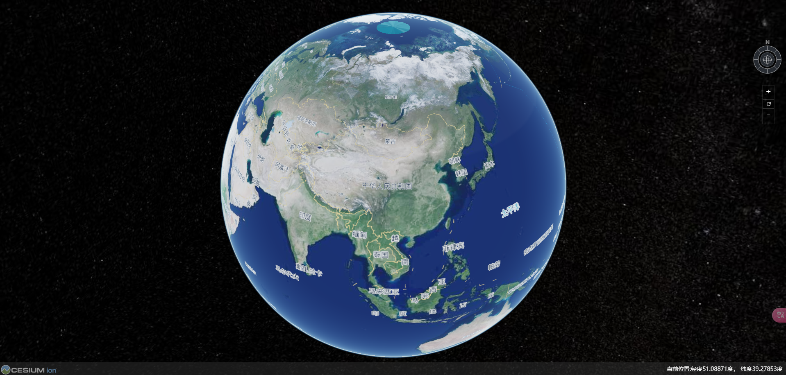
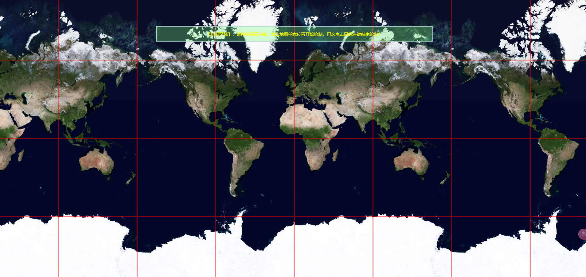

# Vue 3 + Vite Cesium | MapBox | Leaflet

### 1、Setup
npm install

### 2、Development：Compile and Hot-Reload
npm run dev

### 3、Production ：Type-Check, Compile and Minify for Production
npm run build

### Preview
#### Cesium

#### LeafLet

